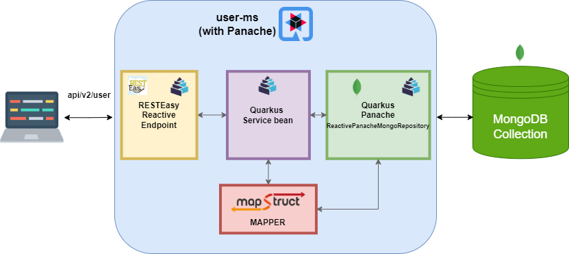

# quarkus-microservice-poc

## Overview

POC microservice (**user-ms**) implemented with Quarkus and some of its extensions.
This microservice receives HTTP requests and performs various MongoDB operations, with data representing hypothetical users in a system.  
This was used as the code demo for the 'Quarkus' section of the [DevStaff "Battle of Java Frameworks" event](https://www.meetup.com/devstaff/events/294641142) (13/07/2023).

Please note that a Maven version of **3.8.2** or higher is required in order to run Maven goals from the `quarkus-maven-plugin` (for example: `mvn quarkus:dev` which can be used to run the application in [development mode](https://quarkus.io/guides/getting-started#development-mode)).

The project also requires a container engine to be running in the background (e.g. Docker) in order for it to run locally in development mode.   
It has been developed in Java 17.

This project is not meant to represent something that is (or should be) used in a production scenario, it is just a demonstration of the features of Quarkus and some of its most important extensions.

## Extensions & Libraries

* **RESTEasy Reactive** -> Ηandles the HTTP requests/responses, and the **automatic subscription** to the Uni/Multi transformations.
* **MapStruct** -> Handles transformations between model objects / entity objects / DTOs.
* **ReactiveMongoClient** -> A component provided by the Quarkus MongoDB extension for executing MongoDB operations in a reactive (asynchronous & non-blocking) way.
* **Panache (ReactivePanacheMongoRepository)** -> Panache is a Quarkus extension built upon Hibernate ORM. `ReactivePanacheMongoRepository` is a component of Panache, executing MongoDB CRUD operations in a reactive way with very little extra code needed by the developer. 
* **SmallRye OpenAPI** -> The default implementation Quarkus uses to generate OpenAPI specifications & Swagger UI pages.
* **SmallRye Mutiny** -> Quarkus and all of the above mentioned extensions use SmallRye Mutiny to express and implement all of their reactive APIs and operations.

## Test requests

**A collection with sample HTTP requests are available in the `docs/requests` directory, in 
`json` and `har` formats [here](doc/requests).** They have been tested with Postman and Insomnia.

With the preset configuration properties for local execution (found in `main/resources/application.properties`), you can see the OpenAPI and SwaggerUI pages for this application respectively from the following links (app must be running locally):

`http://localhost:8080/openapi?format=json`  
`http://localhost:8080/swagger-ui/`

## Diagrams

